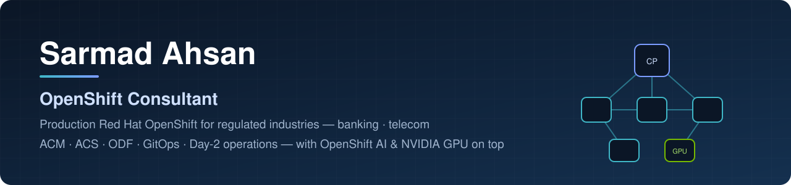
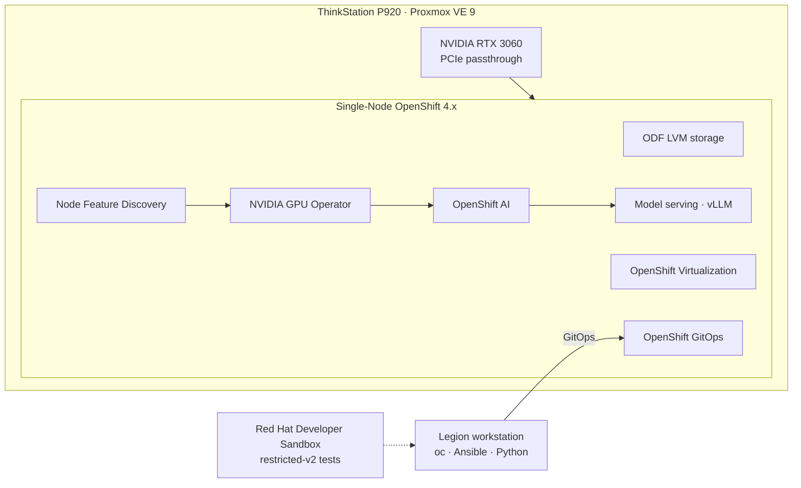

  

  
  
  
  

I design, run and fix **production Red Hat OpenShift** where downtime and audit findings are not an option. Most recently I was the resident OpenShift consultant on the platform of a **MENA tier-1 bank (PCI-DSS Level 1)** — segregated DC, DMZ and DR clusters. Before that I delivered OpenShift, ODF, Red Hat Virtualization, Keycloak and middleware platforms for banks, a national telecom operator and managed-service clients.

When the platform does not give me the answer, I build the tool — and I publish what I learn here.

## How I can help
| You need | What I do |
|---|---|
| **A new or rebuilt cluster** | OpenShift 4.x on bare metal, vSphere or SNO — HA/DR design, install, hand-over runbooks |
| **Safe upgrades** | upgrade-path planning, operator-catalog checks, pre-checks and rollback plan |
| **Security & audit** | SCC / restricted-v2, RBAC + LDAP access reviews, NetworkPolicy segmentation, certificate lifecycle, PCI-DSS / SAMA evidence |
| **Many clusters** | Advanced Cluster Management, Advanced Cluster Security, OpenShift GitOps (Argo CD) |
| **Storage** | OpenShift Data Foundation (Ceph) — replacing NFS/SAN, capacity and S3 |
| **Apps & middleware on OpenShift** | Keycloak / Red Hat SSO, 3scale, AMQ, IBM Cloud Pak — platform-side deployment and troubleshooting |
| **AI on OpenShift** | OpenShift AI, NVIDIA GPU Operator, model serving — building it in my own lab |

## Proof, not slides
<!-- PROJECTS:START -->
**Tools & field notes**

| Project | What it does | Stack | ★ | Updated |
|---|---|---|---|---|
| [ocp-node-connectivity-checker](https://github.com/SarmadBytes/ocp-node-connectivity-checker) | Check network reachability from every OpenShift node to a destination in one run (oc debug + curl), with logs and a summary table | bash, day2-operations, kubernetes, networking, openshift | 0 | 2026-10-05 |
| [openshift-field-notes](https://github.com/SarmadBytes/openshift-field-notes) | Real OpenShift production problems and how they were fixed: SCC, certificates, upgrades, nodes, storage | kubernetes, openshift, red-hat, runbooks, troubleshooting | 0 | 2026-10-05 |
<!-- PROJECTS:END -->

**Making open-source tools run on OpenShift.** Many popular projects break under OpenShift's `restricted-v2` SCC (random UIDs, no root). I fix that upstream where I can, and publish "for OpenShift" versions with full credit where I can't.

### Upstream contributions
<!-- CONTRIB:START -->
_First upstream pull requests coming this month — OpenShift docs, llm-d, KubeArmor._
<!-- CONTRIB:END -->

### Latest field notes
Real production problems and exactly how they were fixed → [openshift-field-notes](https://github.com/SarmadBytes/openshift-field-notes)
<!-- NOTES:START -->
- #007 · [Graceful node reboot](https://github.com/SarmadBytes/openshift-field-notes/tree/main/issues/007-graceful-node-reboot)
- #006 · [Extend node root disk](https://github.com/SarmadBytes/openshift-field-notes/tree/main/issues/006-extend-node-root-disk)
- #005 · [Ingress ssl certificate](https://github.com/SarmadBytes/openshift-field-notes/tree/main/issues/005-ingress-ssl-certificate)
- #004 · [Nodejs permission denied](https://github.com/SarmadBytes/openshift-field-notes/tree/main/issues/004-nodejs-permission-denied)
- #003 · [Vsphere permissions](https://github.com/SarmadBytes/openshift-field-notes/tree/main/issues/003-vsphere-permissions)
- #002 · [Service account token 4.17](https://github.com/SarmadBytes/openshift-field-notes/tree/main/issues/002-service-account-token-4.17)
- #001 · [Pod crashloop](https://github.com/SarmadBytes/openshift-field-notes/tree/main/issues/001-pod-crashloop)
<!-- NOTES:END -->

## My OpenShift AI lab
Everything I publish is tested here first.

## Toolbox
- **Platform:** OpenShift 4.x · Kubernetes · ACM · ACS · ODF/Ceph · Quay · OpenShift Virtualization · RHV
- **Delivery:** Argo CD · Tekton · Helm · Kustomize · Ansible/AAP · Terraform · GitHub Actions
- **Observe & secure:** Prometheus/PromQL · Grafana · Dynatrace · ELK · SCC · NetworkPolicy · Keycloak
- **Code:** Python · Bash · YAML
- **AI infra:** OpenShift AI · NVIDIA GPU Operator · vLLM

## Now
<!-- NOW:START -->
- 🔧 Building: OpenShift AI + NVIDIA GPU Operator on Single-Node OpenShift
- 📦 Shipping: one cleaned-up tool or "for OpenShift" port every week
- 🎓 Studying: RHCA in OpenShift track (EX280 → EX380), NVIDIA NCA-AIIO
<!-- NOW:END -->

---
OpenShift is a trademark of Red Hat, LLC. Kubernetes is a registered trademark of The Linux Foundation. Personal profile — not affiliated with either. · Last updated: <!-- DATE:START -->2026-10-05<!-- DATE:END -->
